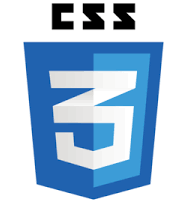

<!-- 

 -->

<h1 align="center">Hello there! </h1>

 <h3>ABOUT ME:</h3>
 I'm a Full Stack developer mostly oriented towards the Front-end 👩🏽‍💻 

 - 🪐 I like to pay special attention to visual details and I am very interested in creating a great user interface.
 - 🤓 I love to learn new things and teach others what I know.
 - 🌱 I have a background as a biologist.
---
<h3>LANGUAGES AND TOOLS</h3>

JavaScript | React JS | Redux | Node JS | Express | PostgreSQL | Sequelize | HTML | CSS | Trello | Slack 

  
    &nbsp;
  
    &nbsp;
  
    &nbsp;
  
    &nbsp;
  
    &nbsp;
  
    &nbsp;
  
    &nbsp;
  
    &nbsp;
  
    &nbsp;
  
    &nbsp;
  
    &nbsp;

---

<h3>TAKE A LOOK TO MY PROJECTS</h3>

